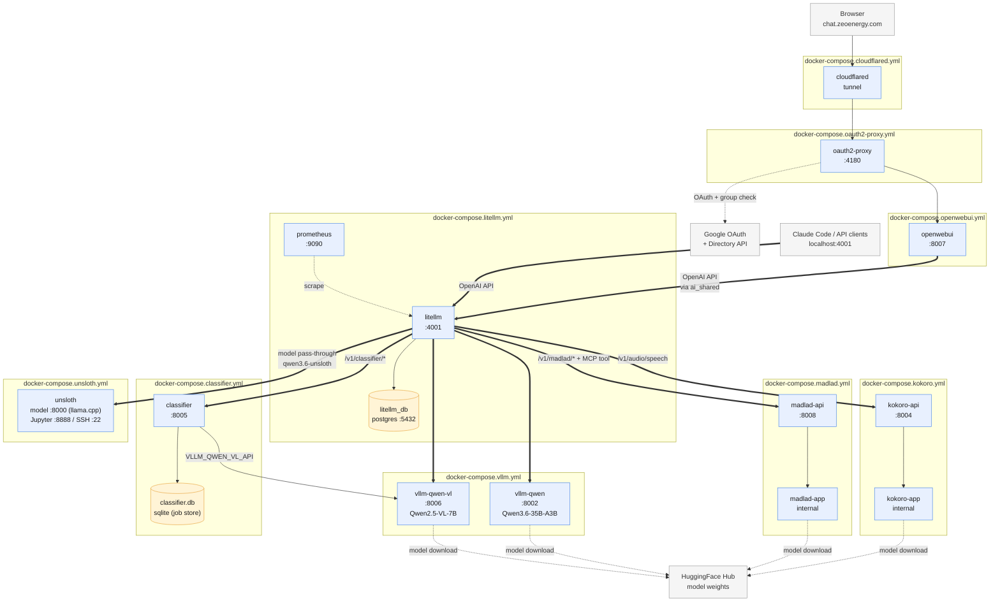

# Docker Infrastructure

Each product is packaged as its own `docker-compose.*.yml` under `ai/` and can be started independently. Every container is attached to a shared external Docker network (`ai_shared`) so services resolve each other by container name (e.g. `http://litellm:4000`, `http://vllm-qwen-vl:8000`).

## Shared Docker network

Create it once before starting any compose file:

```bash
docker network create ai_shared
```

Or via make:

```bash
make network
```

The `make setup` target creates the network automatically.

## Compose files

Every service in the list below is on the `ai_shared` network unless noted. Ports shown are the **host** ports the container publishes (sourced from `.env` — the values in the table are the documented defaults).

| Compose file | Service(s) | Host port | README |
|---|---|---|---|
| [`docker-compose.yml`](docker-compose.yml) | _(none — just declares the external `ai_shared` network)_ | — | — |
| [`docker-compose.litellm.yml`](docker-compose.litellm.yml) | `litellm`, `litellm_db`, `prometheus` | `4001`, `5432`, `9090` | [LITELLM.md](LITELLM.md) · [LITELLM_MCP.md](LITELLM_MCP.md) |
| [`docker-compose.openwebui.yml`](docker-compose.openwebui.yml) | `openwebui` | `8007` | [OPENWEBUI.md](OPENWEBUI.md) |
| [`docker-compose.oauth2-proxy.yml`](docker-compose.oauth2-proxy.yml) | `oauth2-proxy` | `4180` | [OAUTH2_PROXY.md](OAUTH2_PROXY.md) |
| [`docker-compose.cloudflared.yml`](docker-compose.cloudflared.yml) | `cloudflared` | _(outbound tunnel — no publish)_ | see [OPENWEBUI.md § Cloudflare Tunnel](OPENWEBUI.md#public-hostname-via-cloudflare-tunnel) |
| [`docker-compose.vllm.yml`](docker-compose.vllm.yml) | `vllm-qwen`, `vllm-qwen-vl` | `8002`, `8006` | [VLLM.md](VLLM.md) · [GPU_SHARING_GUIDE.md](GPU_SHARING_GUIDE.md) |
| [`docker-compose.kokoro.yml`](docker-compose.kokoro.yml) | `kokoro-api`, `kokoro-app` (internal) | `8004` | [KOKORO.md](KOKORO.md) |
| [`docker-compose.madlad.yml`](docker-compose.madlad.yml) | `madlad-api`, `madlad-app` (internal) | `8008` | [MADLAD.md](MADLAD.md) |
| [`docker-compose.classifier.yml`](docker-compose.classifier.yml) | `classifier` | `8005` | [classifier/API.md](classifier/API.md) |
| [`docker-compose.unsloth.yml`](docker-compose.unsloth.yml) | `unsloth` | `8000` (model — LiteLLM upstream), `8888` (Jupyter), `22` (SSH) | [UNSLOTH.md](UNSLOTH.md) |

## Flow diagram

Solid arrows are runtime request paths; dotted arrows are auxiliary (metrics scraping, model-weight downloads, OAuth callbacks). Node → README links live in the [Compose files](#compose-files) table above.



### Reading the diagram

- **Public entry point** — only `cloudflared` receives inbound traffic from outside the LAN. Every request to `chat.zeoenergy.com` transits `cloudflared → oauth2-proxy → openwebui`.
- **Fan-out from LiteLLM** — LiteLLM is the single OpenAI-compatible surface. Chat models are served by vLLM and Unsloth (llama.cpp); TTS by Kokoro; translation by MADLAD; image-quality by the classifier. Open WebUI and any external Claude Code / API client both hit LiteLLM the same way.
- **Two-container app/api pattern** — Kokoro and MADLAD each split into an internal `-app` (model on GPU, blocking) and a `-api` proxy (stateless, non-blocking). Only the `-api` half is published to the host.
- **Classifier ↔ vLLM** — the classifier is a vLLM client, not a peer; it calls `vllm-qwen-vl` internally for LLM scoring. Its own SQLite job store (`classifier.db` on the `classifier_data` volume) persists async `/assess` job state so callers can poll `GET /jobs/{id}` across restarts.
- **Unsloth dual role** — the CUDA-compiled llama.cpp binary serves a chat model at `unsloth:8000` (routed via LiteLLM as the `qwen3.6-unsloth` model entry sourced from `DEFAULT_LITELLM_MODEL_API_BASE`), while Jupyter (`:8888`) and SSH (`:22`) remain available for training / fine-tuning workflows.

## Ports at a glance

Ports are sourced from `.env` (`PORT_*` variables). Defaults shown; change them in `.env` if any conflict on the host.

| Service | Host port |
|---|---|
| oauth2-proxy | `4180` |
| litellm | `4001` |
| litellm_db (postgres) | `5432` |
| prometheus | `9090` |
| openwebui | `8007` |
| vllm-qwen | `8002` |
| vllm-qwen-vl | `8006` |
| kokoro-api | `8004` |
| madlad-api | `8008` |
| classifier | `8005` |
| unsloth (Jupyter / model / SSH) | `8888` / `8000` / `22` |
