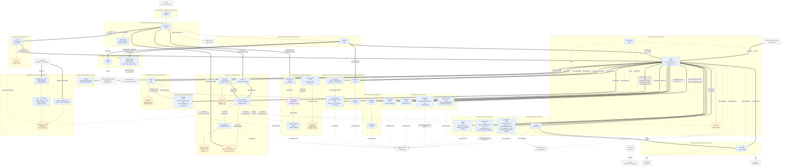

# Docker Infrastructure

Each product is packaged as its own `docker-compose.*.yml` under `ai/` and can be started independently. Every container is attached to a shared external Docker network (`ai_shared`) so services resolve each other by container name (e.g. `http://litellm:4000`, `http://vllm-qwen-vl:8000`).

## Shared Docker network

Create it once before starting any compose file:

```bash
docker network create ai_shared
```

Or via make:

```bash
make network
```

The `make setup` target creates the network automatically.

`make network` also creates a second, deliberately narrow bridge:

```bash
docker network create terminal_net
```

`terminal_net` joins exactly two containers — `open-terminal` and `openwebui` — keeping the model-driven shell away from every service on `ai_shared`. See [Open Terminal is off `ai_shared` too](#reading-the-diagram) below and [OPEN_TERMINAL.md](open-terminal/OPEN_TERMINAL.md). The sandbox subsystem's `sandbox_net` / `sandbox_state` / `sandbox_egress_out`, Trino's `analytics_net`, and Supabase's `supabase_net` are declared inside their own compose files and need no manual creation.

## Compose files

Every service in the list below is on the `ai_shared` network unless noted. Ports shown are the **host** ports the container publishes (sourced from `.env` — the values in the table are the documented defaults).

| Compose file | Service(s) | Host port | README |
|---|---|---|---|
| [`docker-compose.yml`](docker-compose.yml) | _(none — just declares the external `ai_shared` network)_ | — | — |
| [`litellm/docker-compose.litellm.yml`](litellm/docker-compose.litellm.yml) | `litellm`, `litellm_db`, `prometheus` | `4001`, `5432`, `9090` | [LITELLM.md](litellm/LITELLM.md) · [LITELLM_MCP.md](litellm/LITELLM_MCP.md) |
| [`openwebui/docker-compose.openwebui.yml`](openwebui/docker-compose.openwebui.yml) | `openwebui` | `8007` | [OPENWEBUI.md](openwebui/OPENWEBUI.md) |
| [`oauth2-proxy/docker-compose.oauth2-proxy.yml`](oauth2-proxy/docker-compose.oauth2-proxy.yml) | `oauth2-proxy`, `oauth2-assets` | `4180` _(oauth2-assets is internal-only)_ | [OAUTH2_PROXY.md](oauth2-proxy/OAUTH2_PROXY.md) |
| [`cloudflared/docker-compose.cloudflared.yml`](cloudflared/docker-compose.cloudflared.yml) | `cloudflared` | _(outbound tunnel — no publish)_ | [CLOUDFLARED.md](cloudflared/CLOUDFLARED.md) |
| [`vllm/docker-compose.vllm.yml`](vllm/docker-compose.vllm.yml) | `qwen3.6`, `qwen3.8`, `qwen3.8-solo`, `vllm-qwen-vl`, `muse-glimmer` | `8002`, `8003`, `8019`, `8006`, `8018` | [VLLM.md](vllm/VLLM.md) · [GPU_SHARING_GUIDE.md](GPU_SHARING_GUIDE.md) |
| [`llama/docker-compose.llama.yml`](llama/docker-compose.llama.yml) | `glm5.2`, `qwen3.8-flash`, `glm5.3-flash` | `8010`, `8017`, `8020` | [LLAMA.md](llama/LLAMA.md) |
| [`kokoro/docker-compose.kokoro.yml`](kokoro/docker-compose.kokoro.yml) | `kokoro-api`, `kokoro-app` (internal) | `8004` | [KOKORO.md](kokoro/KOKORO.md) |
| [`madlad/docker-compose.madlad.yml`](madlad/docker-compose.madlad.yml) | `madlad-api`, `madlad-app` (internal) | `8008` | [MADLAD.md](madlad/MADLAD.md) |
| [`classifier/docker-compose.classifier.yml`](classifier/docker-compose.classifier.yml) | `classifier` | `8005` | [classifier/API.md](classifier/API.md) |
| [`detector/docker-compose.detector.yml`](detector/docker-compose.detector.yml) | `detector` | `8021` | [DETECTOR.md](detector/DETECTOR.md) |
| [`unsloth/docker-compose.unsloth.yml`](unsloth/docker-compose.unsloth.yml) | `unsloth` | `8000` (model — LiteLLM upstream), `8888` (Jupyter), `22` (SSH) | [UNSLOTH.md](unsloth/UNSLOTH.md) |
| [`roofix/docker-compose.roofix.yml`](roofix/docker-compose.roofix.yml) | `roofix` | _(internal only)_ | [ROOFIX.md](roofix/ROOFIX.md) |
| [`interceptor/docker-compose.interceptor.yml`](interceptor/docker-compose.interceptor.yml) | `interceptor` | _(internal only)_ | [INTERCEPTOR.md](interceptor/INTERCEPTOR.md) |
| [`searxng/docker-compose.searxng.yml`](searxng/docker-compose.searxng.yml) | `searxng` | `8009` | [SEARXNG.md](searxng/SEARXNG.md) |
| [`sandbox/docker-compose.sandbox.yml`](sandbox/docker-compose.sandbox.yml) | `sandbox-runner`, `sandbox-proxy`, `sandbox-egress`, `sandbox-db` | `8012` (runner), `8011` (proxy), `5434` (db) | [SANDBOX.md](sandbox/SANDBOX.md) |
| [`n8n/docker-compose.n8n.yml`](n8n/docker-compose.n8n.yml) | `n8n`, `n8n-db` | `5435` (db) — n8n itself reached via oauth2-proxy at `/n8n/` | [N8N.md](n8n/N8N.md) |
| [`trino/docker-compose.trino.yml`](trino/docker-compose.trino.yml) | `trino-coordinator`, `trino-auth-init`, `hive-metastore`, `hive-metastore-db`, `minio`, `minio-init`, `trino-mcp`, `superset`, `superset-db` | `8013` (trino — HTTPS + password auth), `8014`/`8015` (minio api/console), `8016` (superset), `5436`/`5437` (hms-db / superset-db) — minio-console and superset also reached via oauth2-proxy at `/minio/` and `/superset/` | [TRINO.md](trino/TRINO.md) |
| [`open-terminal/docker-compose.open-terminal.yml`](open-terminal/docker-compose.open-terminal.yml) | `open-terminal` | _(none — **not on `ai_shared`**; on `terminal_net`, reached only by the openwebui backend)_ | [OPEN_TERMINAL.md](open-terminal/OPEN_TERMINAL.md) |
| [`semantic-router/docker-compose.semantic-router.yml`](semantic-router/docker-compose.semantic-router.yml) | `vllm-sr-envoy`, `vllm-sr-router`, `vllm-sr-models-init` (one-shot), `vllm-sr-dashboard` (`dashboard` profile) | `8025` (envoy listener) — **only** published port; router `50051`/`8080`/`9190` and envoy admin `9901` never mapped. `8026` dashboard on `127.0.0.1` only | [SEMANTIC_ROUTER.md](semantic-router/SEMANTIC_ROUTER.md) |
| [`supabase/docker-compose.supabase.yml`](supabase/docker-compose.supabase.yml) | `supabase-db`, `supavisor`, `supabase-api` (Envoy), `auth`, `rest`, `realtime`, `storage`, `imgproxy`, `meta`, `studio`, `functions` | `8022` (gateway + Studio), `8023`/`8024` (pooler session/transaction), `5438` (postgres) — only these three join `ai_shared`; the other eight are on `supabase_net` | [SUPABASE.md](supabase/SUPABASE.md) |

## Flow diagram

Solid arrows are runtime request paths; dotted arrows are auxiliary (metrics scraping, model-weight downloads, OAuth callbacks). Node → README links live in the [Compose files](#compose-files) table above.


```mermaid
flowchart TB
    classDef ext fill:#f5f5f5,stroke:#999,color:#333
    classDef svc fill:#e8f0fe,stroke:#4a86e8,color:#1a1a1a
    classDef store fill:#fff4d6,stroke:#e8a33d,color:#1a1a1a
    classDef standalone fill:#f3e8fd,stroke:#8e63ce,color:#1a1a1a

    Browser["Browser<br/>chat.zeoenergy.com"]:::ext
    Google["Google OAuth<br/>+ Directory API"]:::ext
    HF["HuggingFace Hub<br/>model weights"]:::ext
    CC["Claude Code / API clients<br/>localhost:4001"]:::ext
    Gmail["Gmail<br/>(roofix@zeoenergy.com)"]:::ext
    GmailMCP["gmail-mcp<br/>(external)"]:::ext
    PhoenixMCP["phoenix-mcp.com<br/>(external MCP)"]:::ext
    Roofix["roofix.io<br/>(Bubble app)"]:::ext
    ExtSite["target sites<br/>(any URL)"]:::ext
    SearchEngines["upstream search engines<br/>Google, Bing, DuckDuckGo, …"]:::ext
    PkgRepos["package registries<br/>PyPI, npm, GitHub, Debian"]:::ext

    subgraph CFG["cloudflared/docker-compose.cloudflared.yml"]
        CF["cloudflared<br/>tunnel"]:::svc
    end
    subgraph O2PG["oauth2-proxy/docker-compose.oauth2-proxy.yml"]
        O2P["oauth2-proxy<br/>:4180"]:::svc
        OA["oauth2-assets<br/>nginx internal :80<br/>serves ../assets/"]:::svc
    end
    subgraph OWUG["openwebui/docker-compose.openwebui.yml"]
        OWU["openwebui<br/>:8007"]:::svc
    end
    subgraph LLG["litellm/docker-compose.litellm.yml"]
        LL["litellm<br/>:4001<br/>chain aliases local-* + overflow hook"]:::svc
        DB[("litellm_db<br/>postgres :5432")]:::store
        PROM["prometheus<br/>:9090"]:::svc
    end
    subgraph VG["vllm/docker-compose.vllm.yml"]
        VQ["vllm-qwen<br/>:8002<br/>Qwen3.6-35B-A3B"]:::svc
        VQVL["vllm-qwen-vl<br/>:8006<br/>Qwen2.5-VL-7B"]:::svc
        VMG["muse-glimmer<br/>:8018<br/>Muse-Glimmer-30B BF16 TP=2<br/>+ DFlash drafter"]:::svc
        VQ38S["qwen3.8-solo<br/>:8019<br/>Qwen3.8-27B-AWQ-INT4<br/>single GPU (device 2)"]:::svc
    end
    subgraph LMG["llama/docker-compose.llama.yml"]
        LGLM["glm5.2<br/>:8010<br/>GLM-5.2 UD-IQ1_S<br/>(llama.cpp + CPU MoE offload)"]:::svc
        LQWF["qwen3.8-flash<br/>:8017<br/>Qwen3.8-Flash-Next UD-Q4_K_XL<br/>+ MTP draft head<br/>(Unsloth llama.cpp prebuild)"]:::svc
        LGLMF["glm5.3-flash<br/>:8020<br/>GLM-5.3-Flash UD-Q3_K_XL<br/>+ embedded MTP head<br/>CPU + RAM only, no GPU<br/>(Unsloth llama.cpp CPU prebuild)"]:::svc
    end
    subgraph KG["kokoro/docker-compose.kokoro.yml"]
        KAPI["kokoro-api<br/>:8004"]:::svc
        KAPP["kokoro-app<br/>internal"]:::svc
    end
    subgraph MG["madlad/docker-compose.madlad.yml"]
        MAPI["madlad-api<br/>:8008"]:::svc
        MAPP["madlad-app<br/>internal"]:::svc
    end
    subgraph CLG["classifier/docker-compose.classifier.yml"]
        CLS["classifier<br/>:8005"]:::svc
        CLSDB[("classifier.db<br/>sqlite (job store +<br/>saved references)")]:::store
    end
    subgraph DTG["detector/docker-compose.detector.yml"]
        DET["detector<br/>:8021<br/>OWLv2 open-vocabulary boxes<br/>GPU 2, shared with qwen3.8-solo"]:::svc
    end
    subgraph UG["unsloth/docker-compose.unsloth.yml"]
        UN["unsloth<br/>model :8000 (llama.cpp)<br/>Jupyter :8888 / SSH :22"]:::svc
    end
    subgraph RXG["roofix/docker-compose.roofix.yml"]
        RB["roofix<br/>internal :8080"]:::svc
    end
    subgraph IAG["interceptor/docker-compose.interceptor.yml"]
        IA["interceptor<br/>internal :8080"]:::svc
    end
    subgraph SXG["searxng/docker-compose.searxng.yml"]
        SX["searxng<br/>:8009"]:::svc
    end
    subgraph SBG["sandbox/docker-compose.sandbox.yml<br/>(network-segmented)"]
        SBR["sandbox-runner<br/>:8012<br/>FastAPI + MCP + docker.sock"]:::svc
        SBP["sandbox-proxy<br/>:8011<br/>Caddy /{id}/*"]:::svc
        SBE["sandbox-egress<br/>internal<br/>tinyproxy allowlist"]:::svc
        SBD[("sandbox-db<br/>postgres :5434<br/>sandbox_state net")]:::store
        SBX["sandbox-{id}<br/>ephemeral<br/>sandbox_net only"]:::standalone
    end
    subgraph N8NG["n8n/docker-compose.n8n.yml"]
        N8N["n8n<br/>:5678 internal<br/>(via /n8n/)"]:::svc
        N8NDB[("n8n-db<br/>postgres :5435")]:::store
    end
    subgraph OTG["open-terminal/docker-compose.open-terminal.yml<br/>(network-segmented)"]
        OT["open-terminal<br/>internal :8000<br/>terminal_net only<br/>shell + files, per-user /home"]:::svc
    end
    subgraph TRG["trino/docker-compose.trino.yml"]
        TR["trino-coordinator<br/>:8013 https + password<br/>(federated SQL)"]:::svc
        HMS["hive-metastore<br/>thrift :9083 internal"]:::svc
        HMSDB[("hive-metastore-db<br/>postgres :5436<br/>analytics_net")]:::store
        MINIO[("minio<br/>api :8014 / console :8015<br/>iceberg warehouse")]:::store
        TMCP["trino-mcp<br/>internal :8080<br/>SELECT-only shim"]:::svc
        SS["superset<br/>:8016 (via /superset/)"]:::svc
        SSDB[("superset-db<br/>postgres :5437<br/>analytics_net")]:::store
    end
    subgraph SRG["semantic-router/docker-compose.semantic-router.yml"]
        SRE["vllm-sr-envoy<br/>:8025 -> :8899 listener<br/>ext_proc + Lua bearer auth"]:::svc
        SRR["vllm-sr-router<br/>internal :50051 / :8080 / :9190<br/>signals -> static decision -> chain alias"]:::svc
    end
    subgraph SUPG["supabase/docker-compose.supabase.yml"]
        SUPAPI["supabase-api :8022<br/>Envoy gateway<br/>+ Studio basic auth"]:::svc
        SUPDB[("supabase-db :5438<br/>postgres 17<br/>+ trino_reader role")]:::store
        SUPPOOL["supavisor :8023 / :8024<br/>session / transaction pooler"]:::svc
        SUPSVC["auth · rest · realtime<br/>storage · imgproxy · meta<br/>studio · functions<br/>supabase_net only"]:::svc
    end

    Browser --> CF --> O2P --> OWU
    O2P -->|"/assets/* (skip-auth)"| OA
    O2P -. OAuth + group check .-> Google
    OWU  ==>|OpenAI API<br/>via ai_shared| LL
    CC   ==>|OpenAI API| LL

    LL ==>|"model pass-through<br/>qwen3.6-unsloth"| UN
    LL ==> VQ
    LL ==> VQVL
    LL ==> VMG
    LL ==> VQ38S
    LL ==> LGLM
    LL ==> LQWF
    LL ==> LGLMF
    LL ==>|"/v1/audio/speech"| KAPI
    LL ==>|"/v1/madlad/* + MCP tool"| MAPI
    LL ==>|"/v1/classifier/*"| CLS
    LL ==>|"/v1/detector/*"| DET
    LL -.->|MCP registration| DET
    LL --> DB
    PROM -. scrape .-> LL
    PROM -. scrape .-> CLS
    PROM -. scrape .-> DET

    KAPI --> KAPP
    MAPI --> MAPP
    CLS  -->|VISION_LLM_API| VMG
    CLS  -->|"DETECTOR_URL<br/>POST /detect"| DET
    CLS  --> CLSDB
    DET  -. model download .-> HF

    RB   ==>|OpenAI SDK<br/>brain fallback| LL
    RB   ==>|"HTTP<br/>/capture"| IA
    RB   -->|"MCP JSON-RPC"| GmailMCP
    RB   -->|"MCP JSON-RPC"| PhoenixMCP
    LL   -.->|MCP registration| GmailMCP
    LL   -.->|MCP registration| PhoenixMCP
    LL   -.->|MCP registration| IA
    LL   ==>|"/v1/interceptor/*"| IA
    GmailMCP -. IMAP/API .-> Gmail
    IA   -. CDP .-> ExtSite
    IA   -. CDP .-> Roofix

    OWU  ==>|"web search"| SX
    OWU  ==>|"TTS<br/>/v1/audio/speech"| KAPI
    SX   -. HTTPS .-> SearchEngines

    LL   -.->|MCP registration| SBR
    O2P  ==>|"/sandboxes/{id}/*<br/>(same-origin cookie)"| SBP
    SBP  -->|"sandbox_net"| SBX
    SBR  -->|"docker.sock<br/>spawn/reap"| SBX
    SBR  -->|"sql (sandbox_state)"| SBD
    SBX  -->|"HTTP_PROXY"| SBE
    SBE  -. allowlisted HTTPS .-> HF

    OWU  ==>|"terminal tools + file browser<br/>backend proxy over terminal_net"| OT
    OT   -. allowlisted HTTPS<br/>pip / npm / apt .-> PkgRepos

    O2P  ==>|"/n8n/*<br/>(same-origin cookie)"| N8N
    N8N  ==>|"OpenAI SDK<br/>AI + LangChain nodes"| LL
    N8N  --> N8NDB

    LL   -.->|MCP registration| TMCP
    TMCP ==>|"trino DBAPI<br/>SELECT-only"| TR
    O2P  ==>|"/superset/*<br/>(same-origin cookie)"| SS
    O2P  ==>|"/minio/*<br/>(same-origin cookie)"| MINIO
    SS   ==>|"sqlalchemy-trino"| TR
    SS   --> SSDB
    TR   -->|"thrift 9083<br/>analytics_net"| HMS
    HMS  --> HMSDB
    TR   -->|"s3 API<br/>iceberg parquet"| MINIO
    HMS  -.->|"s3a validation"| MINIO
    TR   -.->|"federated<br/>host publish :5432"| DB
    TR   -.->|"federated<br/>ai_shared"| RB
    TR   -.->|"federated<br/>host publish :5434"| SBD
    TR   -.->|"federated<br/>ai_shared, trino_reader"| SUPDB

    LAN["LAN clients<br/>browser · psql · DBeaver"]:::ext
    LAN ==>|"http :8022"| SUPAPI
    LAN ==>|"postgres :8023 / :8024"| SUPPOOL
    LAN -.->|"postgres :5438 (direct)"| SUPDB
    SUPAPI --> SUPSVC
    SUPSVC --> SUPDB
    SUPPOOL --> SUPDB

    LL   ==>|"alias auto -> vllm-sr/auto"| SRE
    SRE  -->|"ext_proc gRPC :50051"| SRR
    SRR  ==>|"routed request -> chain alias<br/>local-general / -code / -reasoning / -private<br/>(forwarded by SRE)"| LL
    LL   -.->|"overflow hook polls /metrics ~1 s<br/>(vllm:num_requests_waiting)"| VQ38S
    LL   -.->|"overflow hook polls /metrics ~1 s"| VMG
    SRR  -. Vela bundles .-> HF
    PROM -. scrape :9190 .-> SRR

    KAPP -. model download .-> HF
    MAPP -. model download .-> HF
    VQ   -. model download .-> HF
    VQVL -. model download .-> HF
    VMG  -. model + DFlash drafter download .-> HF
    VQ38S -. model download .-> HF
    LGLM -. GGUF download .-> HF
    LQWF -. GGUF + MTP head download .-> HF
    LGLMF -. GGUF download .-> HF
```

### Reading the diagram

- **Public entry point** — only `cloudflared` receives inbound traffic from outside the LAN. Every request to `chat.zeoenergy.com` transits `cloudflared → oauth2-proxy → openwebui`, except `/assets/*` which oauth2-proxy short-circuits to the internal `oauth2-assets` nginx sidecar without requiring a session (used to load the branded logo on the pre-auth sign-in and error pages — see [OAUTH2_PROXY.md § Branded sign-in and error pages](oauth2-proxy/OAUTH2_PROXY.md#branded-sign-in-and-error-pages)).
- **Cloudflare caches by extension, cookies or not** — without a dashboard Cache Rule bypassing `chat.zeoenergy.com`, `.png` / `.css` / `.js` responses that oauth2-proxy authenticated get cached at the edge for 4 h and re-served to anonymous clients, and Open WebUI re-branding looks broken for hours after a recreate. See [CLOUDFLARED.md § Cache rule](cloudflared/CLOUDFLARED.md#cache-rule--bypass-for-chatzeoenergycom).
- **Exactly one tunnel connector** — `cloudflared` must be the only connector registered for the tunnel on this host. Cloudflare load-balances across every registered connector, so a leftover host-level `cloudflared.service` serving the same tunnel id makes roughly half of all requests return 502 while the rest succeed — an intermittent failure that looks like a Cloudflare outage. Resetting the tunnel token rotates the secret on the existing tunnel; it does **not** create a new one and does **not** evict a duplicate connector. See [CLOUDFLARED.md § Exactly one connector per tunnel](cloudflared/CLOUDFLARED.md#exactly-one-connector-per-tunnel).
- **Tunnel ingress origins are container-relative** — ingress rules live in the Cloudflare dashboard, not this repo, and are dialed from inside the `cloudflared` container, where `localhost` is the container itself. A container-hosted target uses its **container** port on the service name (`http://litellm:4000`, not the published `localhost:4001`); a host-hosted target uses `host.docker.internal`, which resolves only because the compose file declares `extra_hosts: host.docker.internal:host-gateway`. See [CLOUDFLARED.md § Origin addresses are container-relative](cloudflared/CLOUDFLARED.md#origin-addresses-are-container-relative).
- **Fan-out from LiteLLM** — LiteLLM is the single OpenAI-compatible surface. Chat models are served by vLLM and Unsloth (llama.cpp); TTS by Kokoro; translation by MADLAD; image-quality by the classifier; text-prompted object boxes by the detector. Open WebUI and any external Claude Code / API client both hit LiteLLM the same way.
- **Two-container app/api pattern** — Kokoro and MADLAD each split into an internal `-app` (model on GPU, blocking) and a `-api` proxy (stateless, non-blocking). Only the `-api` half is published to the host.
- **Classifier ↔ vLLM** — the classifier is a vLLM client, not a peer; it calls `muse-glimmer` internally for LLM scoring (`VISION_LLM_API` / `VISION_LLM_MODEL` in the `## Classifier` block of `.env`, passed through by `classifier/docker-compose.classifier.yml`; `vllm-qwen-vl` is still served for LiteLLM's `qwen2.5-vl` alias but the classifier no longer depends on it). Because `muse-glimmer` shares its GPU pair with `qwen3.8`, the classifier only works while `muse-glimmer` is the one running. Its own SQLite job store (`classifier.db` on the `classifier_data` volume) persists async `/assess` job state so callers can poll `GET /jobs/{id}` across restarts; the same DB holds the saved **references** (`reference_examples`, with their images under `CLASSIFIER_REFERENCE_DIR` on the same volume, never swept). A reference-guided scoring call sends up to three images (example, counter-example, candidate), which is why `muse-glimmer` runs `--limit-mm-per-prompt '{"image": 3}'` and why the classifier's `VISION_LLM_MAX_IMAGES_PER_PROMPT` must match it — see [classifier/API.md § References](classifier/API.md#references).
- **Detector is the classifier's "where is X" source, and a tool in its own right** — `detector` runs OWLv2 (`google/owlv2-base-patch16-ensemble`, swappable via `DETECTOR_MODEL`) behind FastAPI + FastMCP: POST an image and a list of free-text labels, get boxes back in the image's original pixels. The classifier calls it over `ai_shared` when `DETECTOR_URL` is set, for a criterion spelled `"type": "detector"` or a `cv` criterion no OpenCV detector matches (its `options.fallback` defaults to the detector), which is what lets an arbitrary `has X` feature localise — and be scored — without a vision-LLM call; see [classifier/API.md § Regions and layers](classifier/API.md#regions-and-layers). It is also registered with LiteLLM twice over, as the `detector.detect_objects` MCP tool and as a `/v1/detector/*` pass-through. Placement is deliberate: `device_ids: ['2']`, the same card as `qwen3.8-solo`, whose 0.90 utilisation leaves enough headroom for OWLv2 in fp16 — `count: all` would put it on the `muse-glimmer` pair and fight the model the classifier depends on. `DETECTOR_DEVICE=cpu` is the documented fallback if that pairing proves fragile (a few seconds per image, same image, no rebuild). The default weights are baked into the image and the `detector_data` volume is seeded from it, so a cold container never reaches HuggingFace; only a changed `DETECTOR_MODEL` downloads. **A failed load does not crash the container** — `GET /health` returns 503 with the loader's error, so an unhealthy detector says what is wrong instead of crash-looping, and the classifier degrades to a note either way. See [DETECTOR.md](detector/DETECTOR.md).
- **Unsloth dual role** — the CUDA-compiled llama.cpp binary serves a chat model at `unsloth:8000` (routed via LiteLLM as the `qwen3.6-unsloth` model entry sourced from `DEFAULT_LITELLM_MODEL_API_BASE`), while Jupyter (`:8888`) and SSH (`:22`) remain available for training / fine-tuning workflows.
- **Muse Glimmer on vLLM with DFlash speculative decoding** — `muse-glimmer` is Meta's dense 29.6B vision-language model served in BF16 across two A6000s (`--tensor-parallel-size 2`) with the official `meta-models/Muse-Glimmer-30B-assistant` DFlash drafter (`--speculative-config '{"method":"dflash",…}'`, 15 draft tokens per verification step). It occupies the same GPU pair as `qwen3.8` at 0.90 utilisation, so the two are mutually exclusive at runtime — bring up one or the other. `qwen3.8-solo` is the same Qwen3.8 model on a single card, pinned to the third GPU with `device_ids: ['2']`, so it can run alongside `muse-glimmer` (at the cost of TP=2 throughput and a 3-sequence cap). LiteLLM alias `muse-glimmer`; `supports_vision: true` so Open WebUI offers image upload. See [VLLM.md § Muse Glimmer 30B](vllm/VLLM.md#muse-glimmer-30b--tensor-parallel--dflash-speculative-decoding).
- **llama.cpp stack for oversize models** — `llama/docker-compose.llama.yml` runs llama-server for models that don't fit any vLLM-supported precision. `glm5.2` uses the stock `ghcr.io/ggml-org/llama.cpp:server-cuda` image; `qwen3.8-flash` builds a local image from Unsloth's llama.cpp prebuild (`llama/Dockerfile.llama-unsloth`, pinned by `LLAMA_UNSLOTH_TAG` in `.env`) because MTP speculative decoding for Qwen3.8-Flash-Next is not in mainline llama.cpp yet — see [LLAMA.md § MTP speculative decoding](llama/LLAMA.md#qwen38-flash-mtp-speculative-decoding); `glm5.3-flash` builds the same Dockerfile with Unsloth's GPU-free `cpu` tarball (pinned separately by `LLAMA_UNSLOTH_CPU_TAG`) because the GLM-5.3-Flash `glm5next` architecture is not merged upstream at all, and runs GLM-5.3-Flash (321B-A18B) **entirely in system RAM with no GPU reservation** — 148 GB mlocked at UD-Q3_K_XL, with the model's embedded MTP draft head for speculative decoding — see [LLAMA.md § glm5.3-flash](llama/LLAMA.md#glm53-flash--glm-53-flash-on-cpu-and-ram-only). The first inhabitant was `glm5.2` (Z.ai GLM-5.2, 753B-A40B MoE) at UD-IQ1_S (~176 GB), which does not fit in 3× A6000 VRAM alone — `--n-cpu-moe` offloads expert layers into system RAM. Weights auto-download via `-hf` into the `llama_data` named volume on first start. Unlike Unsloth's mixed-purpose container, this stack is inference-only; add new models by copying the commented template block in the compose file. See [LLAMA.md](llama/LLAMA.md) for quant sizing tables and the `--n-cpu-moe` tuning loop.
- **Roofix bridge** — packaged in `roofix/docker-compose.roofix.yml`. Internal worker; does NOT receive inbound traffic. APScheduler ticks every `TICK_INTERVAL_SECONDS` (default 300s); each tick fetches unread Roofix mail via the Gmail MCP, decides per-event (rules first, LiteLLM fallback), and writes back via the Phoenix MCP. Ambiguous email events trigger a proposal fetch via `RoofixScraperClient` (`ai/roofix/components/roofix_scraper_client.py`), which POSTs to `interceptor`'s `/capture` under the `roofix` named profile. The old `roofix-scraper` service was retired — proposal captures now share the generic `interceptor` container with any other logged-in-site capture use case. Operators refresh the Roofix session by uploading a captured Chrome user-data-dir to `interceptor`'s `/profiles/roofix/refresh` (see [INTERCEPTOR.md](interceptor/INTERCEPTOR.md)).
- **Gmail MCP is a passthrough, not a proxied identity** — the `LL -.-> GmailMCP` edge uses LiteLLM's `delegate_auth_to_upstream: true` mode. LiteLLM only advertises the endpoint; the OAuth 2.1 flow runs end-to-end between Open WebUI and `gmailmcp.googleapis.com` per user, and LiteLLM forwards the resulting `Authorization: Bearer` header untouched. Users must enable the Gmail tool per-chat (it cannot be a default-enabled tool on a model, because the OAuth browser redirect cannot happen mid-completion).
- **Interceptor API is a generic CDP capture service** — `interceptor` wraps `common.cdp_interceptor` behind an HTTP + MCP surface. Callers pass a URL and a list of URL regex patterns; the service navigates a headless Chrome under a named `--user-data-dir` and returns the JSON XHR/fetch bodies whose URLs matched — optionally after driving the page (`actions`: fill / click / …), and with screenshots wherever a `{"type": "screenshot"}` action step sits in that list (a screenshot-only call needs no patterns), delivered to models as one MCP image block per step. LiteLLM exposes it both as the MCP tool `interceptor.capture_url` and as a `/v1/interceptor/*` pass-through. Auth is per-profile: operators refresh a profile by uploading a `.tgz` of a captured Chrome user-data-dir to `POST /profiles/{name}/refresh`. Concurrent captures are serialized (409 on collision) because a single container binds one CDP debug port.
- **Kokoro is Open WebUI's voice backend, reached directly** — the `OWU ==> KAPI` edge is Open WebUI's built-in OpenAI TTS engine pointed at `http://kokoro-api:8000/v1` over `ai_shared` (read-aloud and Call mode). It bypasses LiteLLM on purpose: the Open WebUI virtual key is scoped to chat models so `kokoro` never appears in the chat picker, and kokoro-api has no auth to manage. The `LL ==> KAPI` edge is the same endpoint reached by API clients (Claude Code, curl) as `model: kokoro` and by models via the `text_to_speech` MCP tool. Speech-to-text is the faster-whisper model bundled inside the Open WebUI image — no separate container. See [OPENWEBUI.md § Voice (TTS via Kokoro)](openwebui/OPENWEBUI.md#voice-tts-via-kokoro).
- **SearXNG is Open WebUI's web-search backend, not LiteLLM's** — when a user toggles web search on in the chat composer, Open WebUI calls `http://searxng:8080/search?format=json` server-side, injects the top-N results into the prompt, and only *then* dispatches to LiteLLM. Models never call SearXNG directly, and it is not registered as an MCP tool. SearXNG fans out to public search engines (Google, Bing, DuckDuckGo, …) with no API key of its own — see [SEARXNG.md](searxng/SEARXNG.md).
- **Sandbox subsystem is deliberately off `ai_shared`** — unlike every other product, the sandbox stack (`sandbox-runner`, `sandbox-proxy`, `sandbox-egress`, `sandbox-db`, and every spawned `sandbox-{id}` container) runs on two additional Docker networks: `sandbox_net` (bridge, `internal: true`) and `sandbox_state` (bridge, `internal: true`). Because the model-generated code inside a sandbox is untrusted, sandboxes MUST NOT be able to reach `litellm`, `phoenix-mcp`, `roofix-db`, `interceptor`, etc. `sandbox-runner` is the only container that straddles all three networks — it's the audit boundary and the single privileged consumer of `/var/run/docker.sock`. `sandbox-proxy` (Caddy) bridges `ai_shared → sandbox_net` so Open WebUI can iframe `http://sandbox-proxy/{id}/`. Outbound HTTP from sandboxes is forced through `sandbox-egress` (tinyproxy) with a hard-coded destination allowlist (pypi, npmjs, esm.sh, jsdelivr) — everything else drops. `sandbox-db` sits on `sandbox_state` alone so a container-escape in a sandbox cannot tamper with the job store. See [SANDBOX.md](sandbox/SANDBOX.md) for the security-invariant checklist that must be re-verified on every change to the subsystem.
- **Sandbox iframes share the Open WebUI origin** — the iframe `src` returned by `preview_app` is `https://chat.zeoenergy.com/sandboxes/{id}/`, not `http://sandbox-proxy/{id}/`. `oauth2-proxy` has `http://sandbox-proxy:80/sandboxes/` in `OAUTH2_PROXY_UPSTREAMS`, so `chat.zeoenergy.com/sandboxes/*` gets fanned out to sandbox-proxy alongside `chat.zeoenergy.com/*` (openwebui) and `chat.zeoenergy.com/assets/*` (branded sign-in assets). Because the sandbox iframe is same-origin with the chat, the `_oauth2_proxy` cookie is sent automatically — no separate sign-in, no cross-origin CSP surprise. `/sandboxes/*` is NOT in `OAUTH2_PROXY_SKIP_AUTH_ROUTES`, so anonymous requests are still gated. See [SANDBOX.md § Public iframe routing](sandbox/SANDBOX.md#public-iframe-routing) for the traffic-path diagram and how to move to a separate `sandboxes.` subdomain if you want to serve unauthenticated previews.
- **Trino data lake bridges `ai_shared` and `analytics_net`** — Trino coordinator, MinIO (API + console), Superset, and `trino-mcp` sit on `ai_shared` so LiteLLM / OpenWebUI / laptops can reach them. The data plane (HMS ↔ HMS-Postgres ↔ Superset-Postgres) lives on `analytics_net` alone. Model-facing SQL flows `LiteLLM → trino-mcp → trino-coordinator`; humans go `oauth2-proxy → superset → trino-coordinator`. The `TR -.-> DB`, `TR -.-> RB`, `TR -.-> SBD` edges are federation reads issued via Trino — dashed because they cross subsystem boundaries. `litellm_db` and `sandbox-db` are reached via `host.docker.internal` on the host publish (they aren't on `ai_shared`) so Trino doesn't have to join `litellm`'s `internal` network or breach `sandbox_state` isolation; `roofix-db` is on `ai_shared` and uses service DNS. A fifth catalog, `postgres_phoenix`, reaches the off-box Phoenix production Postgres over its public hostname with the same read-only `PHOENIX_DB_*` credentials the Roofix bridge uses (TLS via `sslmode=require`). `trino-mcp` is SELECT-only — `common.trino.TrinoClient` rejects DDL/DML, spliced `LIMIT` caps result rows at `TRINO_MCP_MAX_ROWS`, and `query_max_execution_time` in session properties caps runtime at `TRINO_MCP_MAX_RUNTIME_S`. Superset uses `AUTH_TYPE=AUTH_REMOTE_USER` (trusts the `X-Auth-Request-Email` header from oauth2-proxy) — the host publish on `PORT_SUPERSET` MUST be loopback-bound or dropped before running on an untrusted network, or anyone on the LAN can spoof the header. `PORT_TRINO` (8013) maps to the coordinator's HTTPS listener with password-file auth; the one-shot `trino-auth-init` service generates the self-signed cert and bcrypt `password.db` from `TRINO_JDBC_USERS`. The coordinator's plain-HTTP `:8080` listener is username-only (for `trino-mcp` / Superset inside the Docker networks) and is never published. See [TRINO.md](trino/TRINO.md) for the operator guide.
- **Open Terminal is off `ai_shared` too, on its own `terminal_net`** — `open-terminal` is the code-execution backend that replaces the in-browser Pyodide code interpreter, and it runs code a model wrote on behalf of whoever is chatting. Same reasoning as the sandbox subsystem: from `ai_shared` that shell could reach `roofix-db` / `sandbox-db` / `n8n-db` / `minio` on their dev-default credentials, `litellm` and every virtual key's model surface, n8n's encrypted credential store, and `sandbox-runner` — which mounts `docker.sock`. So it joins a dedicated plain bridge, `terminal_net` (created by `make network` next to `ai_shared`), and `openwebui` is the **only** other member. Unlike `sandbox_net` this network is NOT `internal: true`: the whole point of the fat image is runtime `pip` / `apt` installs, so egress is narrowed inside the container instead — `OPEN_TERMINAL_ALLOWED_DOMAINS` drives a dnsmasq + iptables + ipset allowlist, after which `CAP_NET_ADMIN` is permanently dropped. There is **no host port**: the openwebui *backend* proxies every call (`backend/open_webui/routers/terminals.py`), attaching the bearer key and `X-User-Id` server-side, so the browser never sees the key and nothing on the LAN can reach the shell. `OPEN_TERMINAL_MULTI_USER=true` gives each chatter their own Linux account and `/home/<user>` on the `open_terminal_home` volume — a workspace separation, explicitly **not** a security boundary (one kernel, one process list; real per-user isolation needs Open WebUI Enterprise "Terminals"). `docker.sock` is never mounted here. Terminal operations arrive at the model as native function-calling tools, so a model set to legacy function calling gets none of them. See [OPEN_TERMINAL.md](open-terminal/OPEN_TERMINAL.md).
- **The semantic router is the one place LiteLLM calls itself** — every other edge out of `LL` terminates at a model server. `LL ==> SRE` is the alias `auto` (`openai/vllm-sr/auto`, `api_base: http://vllm-sr-envoy:8899/v1`); `SRE --> SRR` is the ext_proc gRPC hop on `:50051`; and `SRR ==> LL` is the routed request coming back into LiteLLM: the router matches one `static` decision on the prompt's keyword signals, rewrites the body's `model` to a **chain alias** (`privacy_local` → `local-private`, `code` → `local-code`, `reasoning` → `local-reasoning`, everything else → `local-general`), swaps `Authorization` for `SEMANTIC_ROUTER_LITELLM_KEY`, and Envoy forwards it by `x-selected-model` to a per-chain cluster that resolves to `litellm:4000`. **One `auto` turn is one chain request** — no looper fan-out, no confidence escalation (both removed for cost). **Inside LiteLLM the chain picks the backend by `order`**: `local-general` / `local-code` = `qwen3.8-solo` → `muse-glimmer` → `claude-sonnet-5`, `local-reasoning` = `muse-glimmer` → `qwen3.8-solo` → `claude-opus-5-5`, `local-private` = `qwen3.8-solo` → `muse-glimmer` and **no Claude at all**. Each deployment calls its vLLM / Anthropic backend directly (`LL ==> VQ38S`, `LL ==> VMG`). The dashed `LL -.-> VQ38S` / `LL -.-> VMG` edges are the **overflow hook** (`ai/litellm/overflow.py`): LiteLLM polls each local vLLM's `/metrics` about once a second and, inside a chain, drops a backend whose waiting queue has persisted (`OVERFLOW_BUSY_AFTER_S`) or whose probe fails, so the order filter moves to the next rung — Claude is reached only when both local models are busy or down, and `local-private` queues locally instead. When the router itself is down, `auto`'s `fallbacks` and `context_window_fallbacks` both go to `local-private`, because nothing has checked the prompt for PII. **The loop is the design, and the guard is two-sided**: the router's `providers.models` lists only the four chain aliases and never `auto` or any `vllm-sr/*` name, and `SEMANTIC_ROUTER_LITELLM_KEY` is a LiteLLM virtual key scoped to exactly those four — so even a mis-edited `config.yaml` 401s instead of spinning until the 840 s listener timeout. Only Envoy's listener is published (`8025`); the router's `50051` / `8080` / `9190` and Envoy's admin `9901` are never mapped, the last because it serves `/quitquitquit` and a config dump containing the listener bearer token. Envoy runs ext_proc with **buffered** request and response bodies, so nothing reaches the caller until the chain has answered — a chat shows a waiting state rather than tokens, and every timer outside Envoy measures time-to-complete-answer. The budget is strictly nested: `OWU → LL` Open WebUI 900 s (`OPENWEBUI_AIOHTTP_CLIENT_TIMEOUT`, a hard total on every chat completion) > `LL ==> SRE` `auto` 870 s > Envoy's listener 840 s > the chain deployments' per-read 240 s (local) / 300 s (Claude); a pre-header timeout inside a chain goes straight to the next order. See [SEMANTIC_ROUTER.md § Timeout budget](semantic-router/SEMANTIC_ROUTER.md#timeout-budget). `SRR -. Vela bundles .-> HF` is the router fetching its own classifier weights on first start (the pinned CLI has no download subcommand; the router image does it). See [SEMANTIC_ROUTER.md](semantic-router/SEMANTIC_ROUTER.md) and [LITELLM.md § Chain aliases and the overflow hook](litellm/LITELLM.md#chain-aliases-and-the-overflow-hook).
- **Supabase is LAN-only and bridges `ai_shared` ↔ `supabase_net`** — `supabase/docker-compose.supabase.yml` runs a full self-hosted Supabase (Postgres 17, Envoy gateway, GoTrue, PostgREST, Realtime, Storage + imgproxy, postgres-meta, Studio, Edge Functions, Supavisor). Only three containers join `ai_shared`: `supabase-api` (the Envoy gateway, `:8022`, the single LAN-facing HTTP surface — `/auth/v1`, `/rest/v1`, `/realtime/v1`, `/storage/v1`, `/functions/v1`, and Studio at `/` behind Envoy basic auth), `supavisor` (`:8023` session / `:8024` transaction pooling — clients log in as `postgres.<tenant>`, not `postgres`), and `supabase-db` (`:5438` for direct psql). The other eight services sit on the compose-managed `supabase_net` alone — the `analytics_net` pattern. Their **service keys are upstream's verbatim** (`auth`, `rest`, `realtime`, …) because the vendored Envoy cluster config addresses them by those hostnames, which is why `container_name` deliberately differs from the service key there; Realtime additionally needs the `realtime-dev.supabase-realtime` network alias. Unlike everything else on this diagram there is **no oauth2-proxy / Cloudflare hop** — public exposure is a deliberate follow-up, so the gates today are Envoy's basic auth on Studio and the legacy HS256 `anon` / `service_role` API keys. `supabase-db` is dual-homed onto `ai_shared` for one reason: so `trino-coordinator` reaches it by service DNS (`supabase-db:5432`) as the `postgres_supabase` catalog, using a read-only `trino_reader` role with `BYPASSRLS` — without that flag every RLS-enabled table reads as zero rows in Trino with no error. Upstream's Logflare + Vector analytics override is **not** added: Vector needs `docker.sock`, which only `sandbox-runner` may mount here. See [SUPABASE.md](supabase/SUPABASE.md).
- **n8n rides on the same shared hostname under `/n8n/`** — same trick as `/sandboxes/*`, one more entry (`http://n8n:5678/n8n/`) in `OAUTH2_PROXY_UPSTREAMS`. On the n8n side, `N8N_PATH=/n8n/` + `N8N_EDITOR_BASE_URL=https://chat.zeoenergy.com/n8n/` + `WEBHOOK_URL=https://chat.zeoenergy.com/n8n/` (all set in `ai/n8n/docker-compose.n8n.yml`) make the editor's HTML and outbound webhook payloads use the subpath-aware URL. The shared oauth2-proxy cookie means one Google sign-in covers both Open WebUI and n8n; **no Cloudflare tunnel change is needed** because it's the same hostname. n8n's AI / LangChain nodes are preconfigured to talk to LiteLLM (`http://litellm:4000/v1` + `DEFAULT_LITELLM_MASTER_KEY`) so workflows don't need per-credential base-URL entry. Workflow rows, credential blobs, and execution history live in the dedicated `n8n-db` Postgres (`:5435`); credentials are encrypted at rest with `N8N_ENCRYPTION_KEY`, which is load-bearing across restarts — see [N8N.md](n8n/N8N.md).

## Ports at a glance

Ports are sourced from `.env` (`PORT_*` variables). Defaults shown; change them in `.env` if any conflict on the host.

| Service | Host port |
|---|---|
| oauth2-proxy | `4180` |
| litellm | `4001` |
| litellm_db (postgres) | `5432` |
| prometheus | `9090` |
| openwebui | `8007` |
| qwen3.6 (vllm) | `8002` |
| qwen3.8 (vllm) | `8003` |
| vllm-qwen-vl | `8006` |
| muse-glimmer (vllm, TP=2 + DFlash) | `8018` |
| qwen3.8-solo (vllm, single GPU) | `8019` |
| glm5.2 (llama.cpp) | `8010` |
| qwen3.8-flash (llama.cpp, Unsloth prebuild) | `8017` |
| glm5.3-flash (llama.cpp, Unsloth CPU prebuild — no GPU) | `8020` |
| kokoro-api | `8004` |
| madlad-api | `8008` |
| classifier | `8005` |
| detector (OWLv2, GPU 2) | `8021` |
| unsloth (Jupyter / model / SSH) | `8888` / `8000` / `22` |
| searxng | `8009` |
| sandbox-proxy | `8011` |
| sandbox-runner | `8012` |
| sandbox-db (postgres) | `5434` |
| n8n-db (postgres) | `5435` |
| n8n | _(none — via oauth2-proxy at `/n8n/`)_ |
| trino-coordinator | `8013` _(HTTPS + password auth; the username-only HTTP listener on 8080 is container-internal and never published)_ |
| minio (S3 API / console) | `8014` / `8015` |
| superset | `8016` _(also via oauth2-proxy at `/superset/`)_ |
| hive-metastore-db (postgres) | `5436` |
| superset-db (postgres) | `5437` |
| trino-mcp | _(none — registered with LiteLLM at `http://trino-mcp:8080/mcp`)_ |
| open-terminal | _(none — reached only by openwebui over `terminal_net`)_ |
| vllm-sr-envoy (semantic router listener) | `8025` |
| vllm-sr-dashboard | `8026` _(bound to `127.0.0.1` only, behind the `dashboard` compose profile)_ |
| vllm-sr-router | _(none — ext_proc gRPC `50051`, management API `8080` and metrics `9190` stay container-internal; prometheus scrapes `vllm-sr-router:9190` over `ai_shared`)_ |
| supabase-api (Envoy gateway + Studio) | `8022` |
| supavisor (pooler — session / transaction) | `8023` / `8024` |
| supabase-db (postgres) | `5438` |
| supabase auth / rest / realtime / storage / imgproxy / meta / studio / functions | _(none — `supabase_net` only, reached through the gateway on `8022`)_ |
